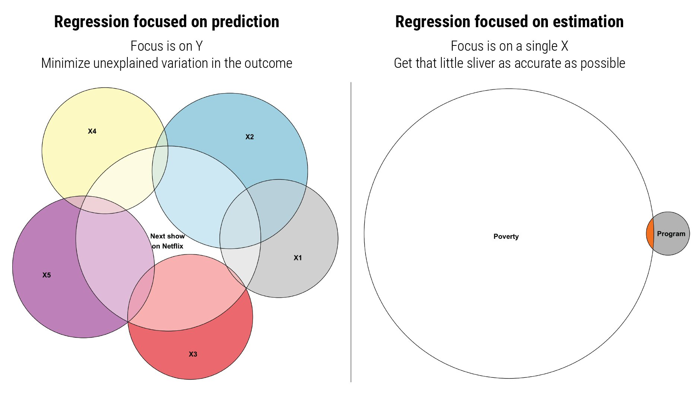

```{r setup, include=FALSE}
knitr::opts_chunk$set(warning = FALSE, message = FALSE, 
                      fig.retina = 3, fig.align = "center")
```

```{r packages-data, include=FALSE}
library(tidyverse)
library(broom)
library(patchwork)
```

```{r xaringanExtra, echo=FALSE}
xaringanExtra::use_xaringan_extra(c("tile_view"))
```

class: center middle main-title section-title-3

# In-person<br>session 2

.class-info[

**August 30, 2021**

.light[PMAP 8521: Program evaluation<br>
Andrew Young School of Policy Studies
]

]

---

name: outline
class: title title-inv-8

# Plan for today

--

.box-5.medium.sp-after-half[Regression FAQs]

--

.box-6.medium.sp-after-half[Miscellaneous R stuff]

--

.box-1.medium.sp-after-half[Visualizing data with **ggplot2**]

--

.box-2.medium.sp-after-half[Transforming data with **dplyr**]

---

layout: false
name: regression-faqs
class: center middle section-title section-title-5 animated fadeIn

# Regression FAQs

---

layout: true
class: middle

---

.box-5.large[Why use `tidy()`<br>from the broom package?]

---

.box-5.medium[How was the 0.05 significance<br>threshold determined?] 

.box-5.medium[Could we say something is significant<br>if p > 0.05, but just note that it is at<br>a higher p-value?<br>Or does it have to fall under 0.05?]

---

.box-5.large[Why all this convoluted<br>logic of null worlds?]

---

layout: false
class: title title-5

# Different "dialects" of statistics

.pull-left[
.box-5.medium[Frequentist]

$$P(\text{data} \mid H_0)$$

.box-inv-5["Regular" statistics;<br>what you've learned<br><small>(and are learning here)</small>]

]

--

.pull-right[
.box-5.medium[Bayesian]

$$P(H \mid \text{data})$$

.box-inv-5[Requires lots of<br>computational power]

]

---

layout: true
class: middle

---

.box-5.medium[Do we care about the actual coefficients<br>or just whether or not they're significant?]

---

.box-5.large[How is R² related to<br>multiple regression?]

---

.center[
<figure>
  
</figure>
]

---

.box-5[Is there a point at which multiple regression<br>becomes inaccurate if you add more variables?<br>Or does it become more accurate if you add more variables?]

.box-5[How many variables does a typical multiple regression<br>usually contain? In published papers, for example.]

---

.center[
<figure>
  
</figure>
]

---

.box-5.large[What counts as a "good" R²?]

---

.center[
<figure>
  
</figure>
]

---

.center[
<figure>
  
</figure>
]

---

.box-5.medium[If we can't use statistics to assert causation<br>how are we going to use this information<br>in program evaluation?]

---

.box-5.large.sp-after[What does logging do?]

.box-5.large[Why do we log things?]

---

.box-5.medium[What's the difference between<br>qualitative columns and categorical columns?<br>Both are text?]

---

layout: false
name: r-questions
class: center middle section-title section-title-6 animated fadeIn

# Miscellaneous R stuff

---

layout: false
name: ggplot
class: center middle section-title section-title-1 animated fadeIn

# Visualizing<br>data with ggplot2

---

layout: false
name: dplyr
class: center middle section-title section-title-2 animated fadeIn

# Transforming<br>data with dplyr
