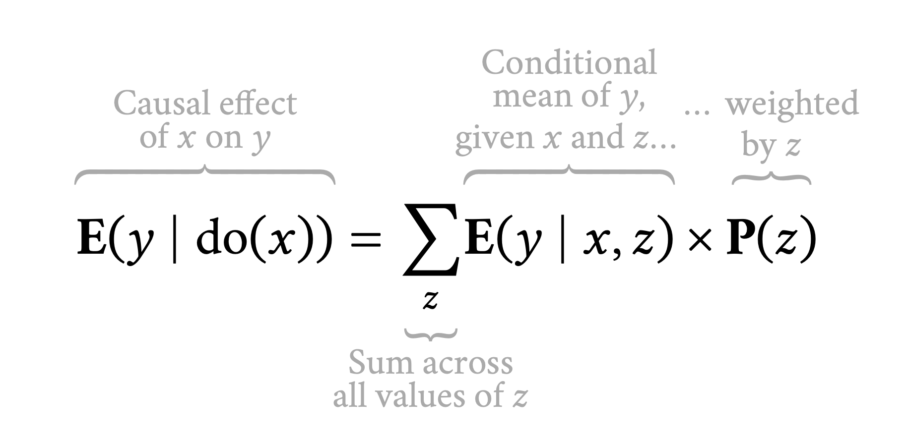

```{r setup, include=FALSE}
knitr::opts_chunk$set(warning = FALSE, message = FALSE, 
                      fig.retina = 3, fig.align = "center")
```

```{r packages-data, include=FALSE}
library(tidyverse)
library(ggdag)
library(palmerpenguins)
library(modelsummary)
```

```{r xaringanExtra, echo=FALSE}
xaringanExtra::use_xaringan_extra(c("tile_view"))
```

class: center middle main-title section-title-3

# In-person<br>session 5

.class-info[

**September 20, 2021**

.light[PMAP 8521: Program evaluation<br>
Andrew Young School of Policy Studies
]

]

---

name: outline
class: title title-inv-8

# Plan for today

--

.box-5.medium.sp-after-half[Colliders]

--

.box-2.medium.sp-after-half[Potential outcomes vs. do() notation]

--

.box-4.medium.sp-after-half[do-calculus, adjustment, and CATEs]

--

.box-6.medium.sp-after-half[Logic models, DAGs, and measurement]

---

layout: false
name: colliders
class: center middle section-title section-title-5 animated fadeIn

# Colliders

---

layout: true
class: middle

---

.box-5.less-medium.sp-after[How do I know which of these is which?]

.center[
<figure>
  
</figure>
]

---

class: middle

.box-5.medium[But what does that mean,<br>"opening a backdoor path"?]

.box-5.medium[How does statistical association<br>get passed through paths?]

---

class: middle

.pull-left[
<figure>
  
</figure>
]

.pull-right[
```{r confounding-dag-alone, echo=FALSE, fig.width=4.5, fig.height=3.35, out.width="100%"}
dagify(
  Y ~ X + Z,
  X ~ Z,
  coords = list(x = c(X = 1, Y = 3, Z = 2),
                y = c(X = 1, Y = 1, Z = 2))
) %>% 
  ggplot(aes(x = x, y = y, xend = xend, yend = yend)) +
  geom_dag_edges() +
  geom_dag_point(color = "grey80", size = 17) +
  geom_dag_text(color = "black", size = 5) +
  theme_dag()
```
]

---

class: middle

.pull-left[
<figure>
  
</figure>
]

.pull-right[
```{r mediating-dag-alone, echo=FALSE, fig.width=4.5, fig.height=3.35, out.width="100%"}
dagify(
  Y ~ X + Z,
  Z ~ X,
  coords = list(x = c(X = 1, Y = 3, Z = 2),
                y = c(X = 1, Y = 1, Z = 2))
) %>% 
  ggplot(aes(x = x, y = y, xend = xend, yend = yend)) +
  geom_dag_edges() +
  geom_dag_point(color = "grey80", size = 17) +
  geom_dag_text(color = "black", size = 5) +
  theme_dag()
```
]

---

class: middle

.pull-left[
<figure>
  
</figure>
]

.pull-right[
```{r colliding-dag-alone, echo=FALSE, fig.width=4.5, fig.height=3.35, out.width="100%"}
dagify(
  Y ~ X,
  Z ~ Y,
  Z ~ X,
  coords = list(x = c(X = 1, Y = 3, Z = 2),
                y = c(X = 1, Y = 1, Z = 2))
) %>% 
  ggplot(aes(x = x, y = y, xend = xend, yend = yend)) +
  geom_dag_edges() +
  geom_dag_point(color = "grey80", size = 17) +
  geom_dag_text(color = "black", size = 5) +
  theme_dag()
```
]

---

layout: true
class: middle

---

d-separation

---

.box-5.medium[How can you be sure<br>you include everything in a DAG?]

.box-5.medium[Is there a rule of thumb<br>for the number of nodes?]

---

.box-5.large[How exactly do colliders<br>mess up your results?]

.box-5.medium[It looks like you can<br>still get the effect of X on Y]

---

.center[
<figure>
  
</figure>
]

???

<https://www.businessinsider.com/facebook-sent-incomplete-misinformation-data-flawed-researchers-2021-9>

<https://www.nytimes.com/live/2020/2020-election-misinformation-distortions#facebook-sent-flawed-data-to-misinformation-researchers>

---

layout: false
class: title title-5

# Does niceness improve appearance?

```{r niceness-appearance-data, include=FALSE}
set.seed(1234)
nice_appearance_data <- tibble(niceness = rnorm(10000, mean = 0, sd = 1),
                               appearance = rnorm(10000, mean = 0, sd = 1))

plot_labels <- tribble(
  ~x, ~y, ~label, 
  -2, 2, "Mean and attractive",
  2, 2, "Nice and attractive",
  2, -2, "Nice and ugly",
  -2, -2, "Mean and ugly",
)

full_sample <- ggplot(nice_appearance_data, aes(x = niceness, y = appearance)) +
  geom_point(color = "grey40", size = 0.5, alpha = 0.8) +
  geom_smooth(size = 2, method = "lm") +
  labs(x = "Niceness", y = "Appearance") +
  theme_bw(base_family = "Fira Sans Condensed")

full_sample_annotated <- full_sample +
  geom_vline(xintercept = 0) +
  geom_hline(yintercept = 0) +
  geom_label(data = plot_labels, aes(label = label, x = x, y = y),
             fill = "#CF4446", color = "white",
             family = "Fira Sans Condensed", fontface = "bold")

collider_bias <- ggplot(filter(nice_appearance_data, 
                               !(niceness <= 0 & appearance <= 0)), 
       aes(x = niceness, y = appearance)) +
  geom_point(color = "grey40", size = 0.5, alpha = 0.8) +
  geom_vline(xintercept = 0) +
  geom_hline(yintercept = 0) +
  geom_smooth(size = 2, method = "lm") +
  geom_label(data = plot_labels, aes(label = label, x = x, y = y),
             fill = "#CF4446", color = "white",
             family = "Fira Sans Condensed", fontface = "bold") +
  labs(x = "Niceness", y = "Appearance") +
  theme_bw(base_family = "Fira Sans Condensed")
collider_bias

collider_dag <- dagify(
  Y ~ X,
  Z ~ X + Y,
  coords = list(x = c(X = 1, Y = 3, Z = 2),
                y = c(X = 1, Y = 1, Z = 2)),
  exposure = "X",
  outcome = "Y"
) %>% 
  tidy_dagitty() %>% 
  node_status() %>% 
  mutate(across(c(name, to), 
                ~recode(., X = "Niceness", Y = "Appearance", 
                        Z = "People you've dated"))) %>% 
  mutate(arrow_color = ifelse(to == "People you've dated", "#F012BE", "black"))

plot_dag <- ggplot(collider_dag, aes(x = x, y = y, xend = xend, yend = yend)) +
  geom_dag_edges(aes(edge_color = arrow_color)) +
  geom_dag_point(aes(color = status), size = 17) +
  geom_dag_text(data = filter(collider_dag, name != "People you've dated"),
                color = "black", size = 5, nudge_y = -0.2,
                family = "Fira Sans Condensed", fontface = "bold") +
  geom_dag_text(data = filter(collider_dag, name == "People you've dated"),
                color = "black", size = 5, nudge_y = 0.2,
                family = "Fira Sans Condensed", fontface = "bold") +
  scale_color_manual(values = c("#2ECC40", "#0074D9"), 
                     na.value = "grey80", guide = "none") +
  coord_cartesian(xlim = c(0.8, 3.2), ylim = c(0.8, 2.2)) +
  theme_dag()
```

.pull-left[

```{r echo=FALSE, fig.width=4.5, fig.height=3.35, out.width="100%"}
full_sample
```

]

--

.pull-right[

```{r echo=FALSE, fig.width=4.5, fig.height=3.35, out.width="100%"}
full_sample_annotated
```

]

---

class: title title-5

# Collider distorts the true effect!

.pull-left[

```{r echo=FALSE, fig.width=4.5, fig.height=3.35, out.width="100%"}
plot_dag
```

]

--

.pull-right[

```{r echo=FALSE, fig.width=4.5, fig.height=3.35, out.width="100%"}
collider_bias
```

]

---

.box-5.large[Effect of race on police use of force<br>using administrative data]

---

.box-5.medium[Effect of race on police use of force<br>using administrative data]

.pull-left[
<figure>
  
</figure>
]

.pull-right[
<figure>
  
</figure>
]

---

layout: false
name: po-do
class: center middle section-title section-title-2 animated fadeIn

# Potential outcomes<br>vs. do() notation

---

layout: true
class: title title-2

---

$$\operatorname{E}(\cdot), \mathbf{E}(\cdot), \mathbb{E}(\cdot) \quad \text{vs.}\quad \operatorname{P}(\cdot)$$

---

# Causal effects with potential outcomes

$$
\begin{aligned}
& \textbf{Potential outcomes notation:} \\
\delta\ =& {\textstyle \frac{1}{n} \sum_{i=1}^n} Y_i (1) - Y_i (0) \\
& \\
& \text{or alternatively with } \textbf{E} \\
\delta\ =& \textbf{E} [Y_i (1) - Y_i (0)] \\
\end{aligned}
$$

---

# Causal effects with do()

$$
\begin{aligned}
& \textbf{Pearl notation:} \\
\delta\ =& \textbf{E}[Y_i \mid \operatorname{do}(X = 1) - Y_i \mid \operatorname{do}(X = 0)] \\
& \\
& \text{or more simply} \\
\delta\ =& \textbf{E} [Y_i \mid \operatorname{do}(X)] \\
\end{aligned}
$$

---

layout: false
class: middle

---

$$
\delta \quad = \quad \textbf{E} [Y_i \mid \operatorname{do}(X)] \quad = \quad \textbf{E} [Y_i (1) - Y_i (0)]
$$

---

.box-2.medium[We can't see this]

$$\textbf{E} [Y_i \mid \operatorname{do}(X)] \quad \text{or} \quad \textbf{E} [Y_i (1) - Y_i (0)]$$

.box-2.medium[So we find the average causal effect (ACE)]

$$
\hat{\delta} = \textbf{E} [Y_i \mid X = 1] - \textbf{E} [Y_i \mid X = 0]
$$

---

.center[
<figure>
  
</figure>
]

---

layout: false
name: po-do
class: center middle section-title section-title-4 animated fadeIn

# do-calculus,<br>adjustment, and CATEs

---

layout: true
class: middle

---

.box-4.medium[
How can you create a DAG/transform the expression and do all the backdoor adjustments to determine causality if you can't possibly think of all variables that may impact your outcome variable?
]

---

.box-4.medium[Where can we learn more about *do*-calculus?]

.box-inv-4[[Here!](https://www.andrewheiss.com/blog/2021/09/07/do-calculus-backdoors/)]

.center[
<figure>
  
</figure>
]

---

.box-4.medium[Adjusting for backdoor confounding]

.center[
<figure>
  
</figure>
]


---

.box-4.medium[Adjusting for frontdoor confounding]

---

.box-4.medium[When you're making groups for CATE, how do you decide what groups to put people in?]

---

layout: false
name: logic-dag
class: center middle section-title section-title-6 animated fadeIn

# Logic models, DAGs,<br>and measurement

---

layout: true
class: middle

---

.box-6.large[What's the difference between<br>logic models and DAGs?]

.box-inv-6[Can't I just remake my logic model in Dagitty and be done?]

---

layout: false
class: title title-6

# DAGs vs. Logic models

.box-6.large[DAGs are a *statistical* tool]

.box-inv-6[Describe a data-generating process<br>and isolate/identify relationships]

--

.box-6.large.sp-before[Logic models are a *managerial* tool]

.box-inv-6[Oversee the inner workings of a program and its theory]

---

class: middle

.pull-left[
<figure>
  
</figure>
]

.pull-right[
<figure>
  
</figure>
]

???

<https://theconversation.com/how-cities-can-add-accessible-green-space-in-a-post-coronavirus-world-139194>

<https://sf.eater.com/2020/5/14/21258980/berkeley-coronavirus-covid-19-jesse-arreguin-street-closures>
