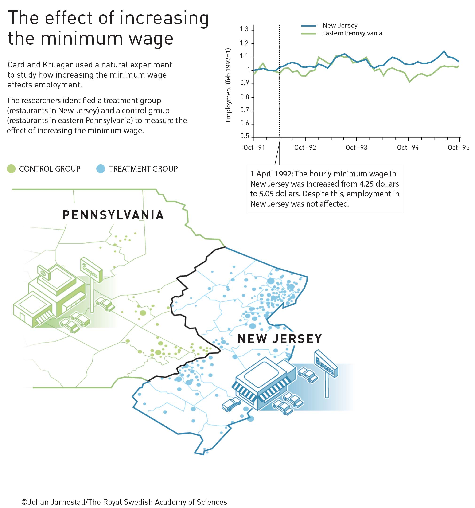
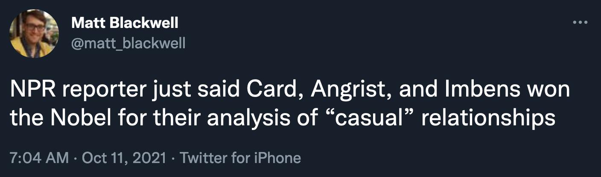
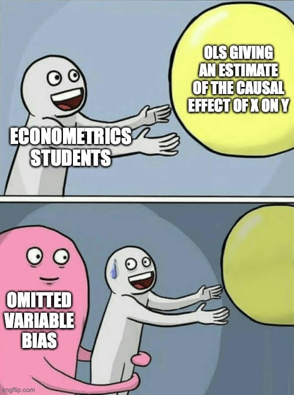
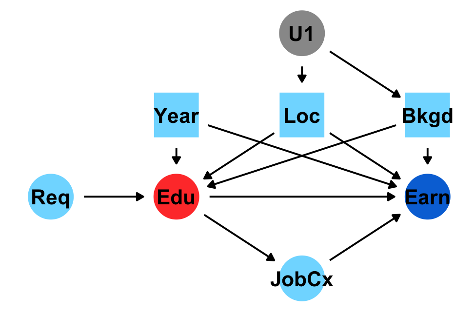
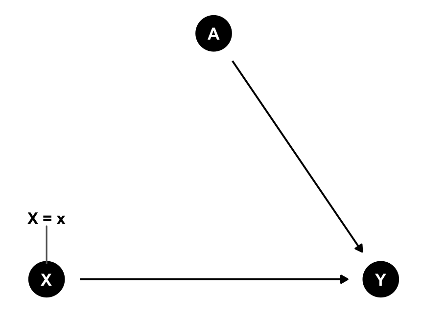
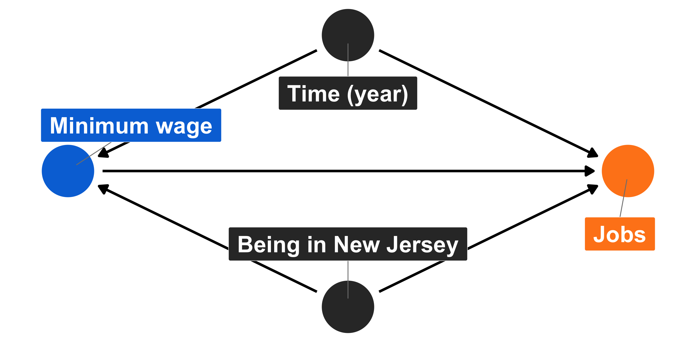
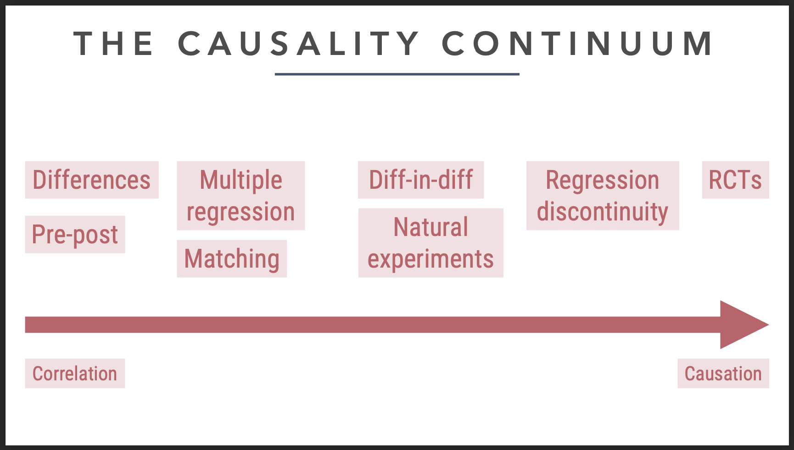
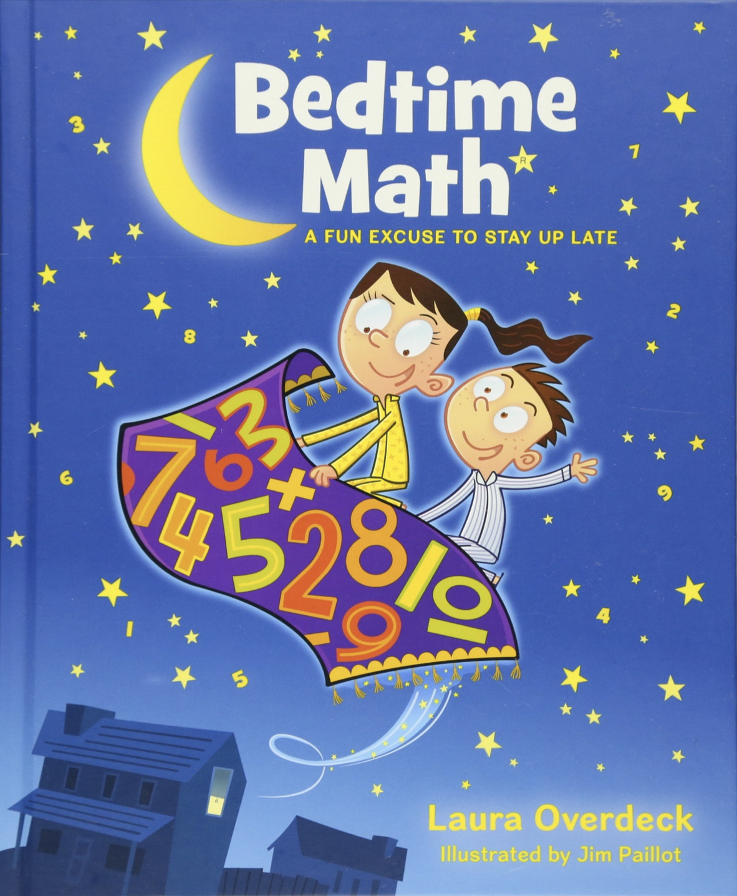
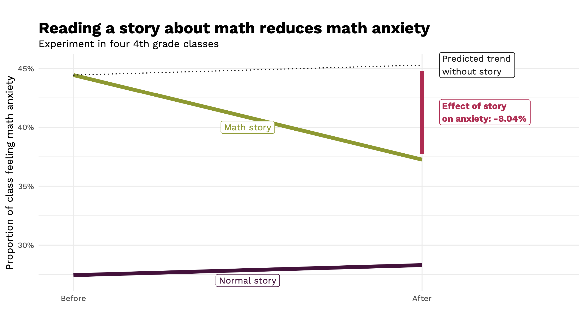

```{r setup, include=FALSE}
knitr::opts_chunk$set(warning = FALSE, message = FALSE, 
                      fig.retina = 3, fig.align = "center")
```

```{r packages-data, include=FALSE}
library(tidyverse)
library(ggdag)
library(palmerpenguins)
library(modelsummary)
```

```{r xaringanExtra, echo=FALSE}
xaringanExtra::use_xaringan_extra(c("tile_view"))
```

class: center middle main-title section-title-3

# In-person<br>session 8

.class-info[

**October 11, 2021**

.light[PMAP 8521: Program evaluation<br>
Andrew Young School of Policy Studies
]

]

---

name: outline
class: title title-inv-8

# Plan for today

--

.box-3.medium.sp-after-half[Econ Nobel!]

--

.box-6.medium.sp-after-half[Sensitivity analysis]

--

.box-5.medium.sp-after-half[Diff-in-diff FAQs]

---

layout: false
name: econ-nobel
class: center middle section-title section-title-3 animated fadeIn

# Econ Nobel

---

layout: true
class: middle

---

.center[
<figure>
  
</figure>
]

???

- Card (and Krueger): NJ/PA minimum wage + the beginning of this whole credibility revolution thing
- Angrist: MHE and MM and making causal inference accessible
- Imbens: A ton of CI stuff + attempting to bridge DAG world with situation-based world

- https://twitter.com/NobelPrize/status/1447502627114205187 - PA/NJ
- https://twitter.com/MaxCRoser/status/1447505582450151431
- https://twitter.com/Stanford/status/1447549033539637248

---

.center[
<figure>
  
</figure>
]

---

.center[
<figure>
  
</figure>
]

---

.center[
<figure>
  
</figure>
]

???

https://twitter.com/matt_blackwell/status/1447518447882096642

---

layout: false
name: sensitivity
class: center middle section-title section-title-6 animated fadeIn

# Sensitivity analysis

---

layout: true
class: middle

---

.box-6.medium.sp-after[How do we know when we've got<br>the right confounders in our DAG?]

.box-6.medium[How do we solve the fact that<br>we have so many unknowns in our DAG?]

---

.center[
<figure>
  
</figure>
]

???

https://owenozier.github.io/teaching/2020-2021-memes

---

layout: false
name: faqs
class: center middle section-title section-title-5 animated fadeIn

# Diff-in-diff FAQs

---

layout: true
class: middle

---

.box-5.large[Design-based vs.<br>model-based inference]

.box-inv-5[Special situations vs. controlling for stuff]

---

layout: true
class: title title-5

---

# Identification strategies

.box-inv-5.small.sp-after[The goal of *all* these methods is to isolate<br>(or **identify**) the arrow between treatment → outcome]

--

.box-inv-5.less-medium[Model-based identification]

.float-left.center[.box-5[DAGs] .box-5[Matching] .box-5[Inverse probability weighting]]

--

.box-inv-5.less-medium.sp-before[Design-based identification]

.float-left.center[.box-5[Randomized controlled trials] .box-5[Difference-in-differences]]

.float-left.center[.box-5[Regression discontinuity] .box-5[Instrumental variables]]

---

# Model-based identification

.box-inv-5[Use a DAG and *do*-calculus to isolate arrow]

.pull-left[
<figure>
  
</figure>
]

.pull-right[
.box-5[Core assumption:<br>selection on observables]

.box-inv-5.small[Everything that needs to<br>be adjusted is measurable;<br>no unobserved confounding]

.box-inv-5.small[**Big assumption!**]

.box-inv-5.tiny[This is why lots of people don't like DAG-based adjustment]
]

---

# Design-based identification

.box-inv-5[Use a special situation to isolate arrow]

.pull-left[
.box-5[RCTs]

.box-inv-5.small[Use randomization<br>to remove confounding]

.center[
<figure>
  
</figure>
]
]

--

.pull-right[
.box-5[Difference-in-differences]

.box-inv-5.small[Use before/after & treatment/control<br>differences to remove confounding]

.center[
<figure>
  
</figure>
]
]

---

layout: true
class: middle

---

.box-5.large[Which is better or more credible?<br>RCTs, quasi experiments,<br>or DAG-based models?]

---

.center[
<figure>
  
</figure>
]

---

.box-5.huge[There's no hierarchy!]

---

.box-5.large[Can we talk more about interaction terms and how to interpret them?]

.box-5[Are interaction effects in regression always more accurate of a difference than running a "regular" regression without them?]

---

.box-5.large[Can causal effects be negative<br>or are they always positive?]

---

.center[
<figure>
  
</figure>
]

---

.pull-left[
.box-5.medium[**1849**]

.box-5[Cholera deaths per 100,000]

.box-inv-5[Southwark & Vauxhall: **1,349**]

.box-inv-5[Lambeth: **847**]

]

.pull-right[
.box-5.medium[**1854**]

.box-5[Cholera deaths per 100,000]

.box-inv-5[Southwark & Vauxhall: **1,466**]

.box-inv-5[Lambeth: **193**]
]

---

.box-5.large[Multiple adjustment sets]

???

DAG from exam 1 and why there are multiple adjustment sets

---

.box-5.large[Where do we get all this data?]

.box-inv-5[lolz]

.box-inv-5[[Data resources](https://evalsp22.classes.andrewheiss.com/resource/data/)]

.box-inv-5[[See this](https://skranz.github.io//r/2021/01/05/FindingEconomicArticles4.html)]

---

.center[
<figure>
  
</figure>
]

???

https://www.theverge.com/22684730/students-file-folder-directory-structure-education-gen-z

- Absolute vs. relative paths
- Best practices for project structures
- File types - jpg/png/pdf, CSV vs. Excel, Word vs. txt vs. md vs. Rmd
- Downloading files from the internet and using them in Rmd - dagitty specifically

---

.box-5.large[Project structures]

.box-inv-5[[One approach](https://kdestasio.github.io/post/r_best_practices/)]

.box-inv-5[[Another approach](https://datacarpentry.org/R-ecology-lesson/00-before-we-start.html#Organizing_your_working_directory)]

.box-inv-5[[Yet another approach](https://github.com/andrewheiss/who-cares-about-crackdown)]

.box-inv-5[[Another another approach](http://projecttemplate.net/)]

---

.box-5.large[File types]

.box-inv-5[[Image types slides](https://datavizs21.classes.andrewheiss.com/slides/02-slides.html#57)]

.box-inv-5[CSV vs. Excel]

.box-inv-5[`.docx` vs. `.txt` vs. `.md` vs `.Rmd`]

---

.center[
<figure>
  
</figure>
]

---

.center[
<figure>
  
</figure>
]

---

.box-5.medium[If the control group changes in the same way, and the causal effect was zero, would we say that the treatment didn't work?]

---

.box-5.medium[When doing your subtracting to get<br>your differences in the matrix, is it better <br>to do the vertical or horizontal subtractions?]

.box-5.medium[Are there situations where<br>one is preferable to the other?]

---

.box-5.medium[Why are we learning<br>two ways to do diff-in-diff?<br>(2x2 matrix vs. `lm()`)]

---

.box-5.less-medium[What group level is best for comparison? For example, if we are looking at policy change in NJ, is it best to compare with just one or two similar states? How similar do the populations need to be?]

.box-5.medium.sp-after[Wouldn't matching be better?]

.box-5.less-medium[Do we have to think about balance when dealing with observational data in diff in diff?]

.box-inv-5[[Two-way fixed effects (TWFE)](https://www.andrewheiss.com/blog/2021/08/25/twfe-diagnostics/)]

???

- Multiple states/groups are possible - that's TWFE
- Wouldn't matching be better? Sure, if you're doing state-level stuff. But their data was restaurant level

- Balance: Maybe. With just two states/villages/countries/whatever, yes. With lots, the state/year fixed effects pick up those trends for you

---

.box-5.large[Minimum legal drinking age]

---

$$\begin{aligned}
\text{Mortality}\ =&\ \beta_0 + \beta_1\ \text{Alabama} + \beta_2\ \text{After 1975}\ + \\
&\ \beta_3\ (\text{Alabama} \times \text{After 1975})
\end{aligned}$$

---

$$\text{Mortality}\ =\ \beta_0 + \beta_1\ \text{Treatment} + \beta_2\ \text{State} + \beta_3\ \text{Year}$$

---

$$\begin{aligned}
\text{Mortality}\ =&\ \beta_0 + \beta_1\ \text{Treatment} + \beta_2\ \text{State}\ + \\
&\ \beta_3\ \text{Year} + \beta_4\ (\text{State} \times \text{Year})
\end{aligned}$$

---

.center[
<figure>
  
</figure>
]

---

.center[
<figure>
  
</figure>
]

---

.center[
<figure>
  
</figure>
]

---

.center[
<figure>
  
</figure>
]

---

.box-5.large[What happened to confounding??]

.box-5.large[Now we're only looking<br>at just two "confounders"?]

???

The parallel trends assumption takes care of that

---

.box-5.medium[Is it reasonable to conduct<br>sensitivity analysis when working<br>with diff in diff?]

---

.box-5.large[How do we play with time<br>to check for parallel trends?]

---

.box-5.large[What about this<br>staggered treatment stuff?]

.box-inv-5[[See this](https://www.andrewheiss.com/blog/2021/08/25/twfe-diagnostics/)]

???

This is good for ethical reasons!

Blog post
