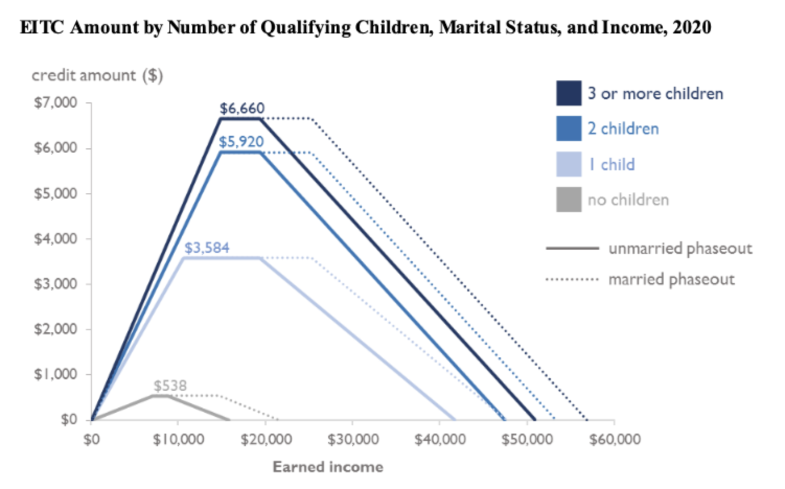
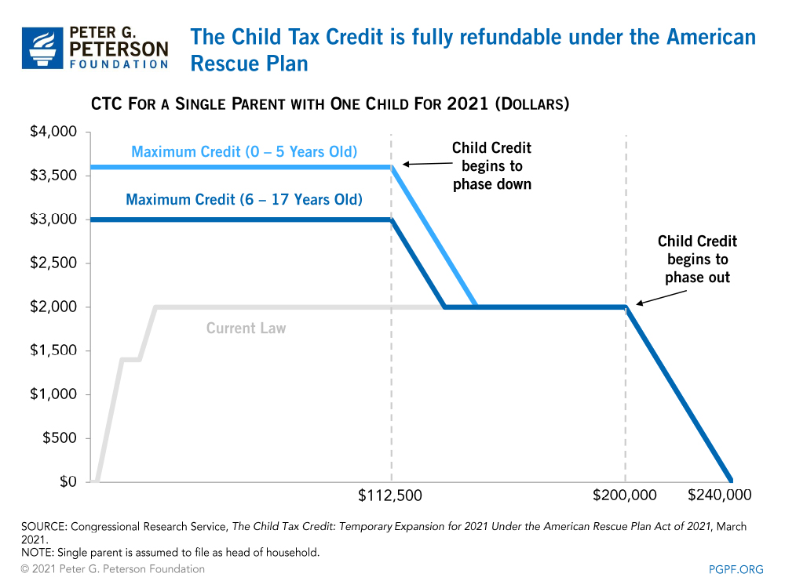

```{r setup, include=FALSE}
knitr::opts_chunk$set(warning = FALSE, message = FALSE, 
                      fig.retina = 3, fig.align = "center")
```

```{r packages-data, include=FALSE}
library(tidyverse)
library(kableExtra)
library(scales)
```

```{r xaringanExtra, echo=FALSE}
xaringanExtra::use_xaringan_extra(c("tile_view"))
```

class: center middle main-title section-title-3

# In-person<br>session 11

.class-info[

**November 1, 2021**

.light[PMAP 8521: Program evaluation<br>
Andrew Young School of Policy Studies
]

]

---

name: outline
class: title title-inv-8

# Plan for today

--

.box-2.medium.sp-after-half[Diff-in-diff effect sizes]

--

.box-5.medium.sp-after-half[Miscellaneous R stuff]

--

.box-6.medium.sp-after-half[RDD fun times]

--

.box-1.medium.sp-after-half[IV fun times]

---

layout: false
name: ps5
class: center middle section-title section-title-2 animated fadeIn

# Diff-in-diff effect sizes

---

layout: true
class: middle

---

.box-2.large[What the heck was happening at<br>the end of problem set 5?!]

---

layout: false
name: r-stuff
class: center middle section-title section-title-5 animated fadeIn

# Miscellaneous R stuff

---

layout: true
class: middle

---

.box-5.large[Is there a way to make<br>the date update automatically<br>in the title area?]

---

.box-5.large[Lines across categories]

---

.box-5.large[What do all those things like<br>"AIC" mean in model tables?]

.box-5.large[Can we control what<br>shows up in those tables?]

.center[[See this](https://vincentarelbundock.github.io/modelsummary/articles/modelsummary.html)]

---

layout: false
name: rdd
class: center middle section-title section-title-6 animated fadeIn

# RDD fun times

---

layout: true
class: middle

---

.box-6.medium[With RDD we rely on "the rule" to determine treatment and control groups]

.box-6[How do you decide on the rule? You mentioned that it's arbitrary—we can choose whatever rule we want?]

---

.box-6.medium[Can we use RDD to evaluate a program that doesn't have a rule for participation?]

---

.box-6.medium[If a program is implemented in City A and not City B, can we use RDD to analyze its effect?]

---

.box-6.medium[Is there a rule of thumb to determine which quasi-experiment method we should use?]

---

.box-6.medium[Where do these eligibility thresholds come from? Do policy makers research them first and reexamine them later?]

---

layout: true
class: title title-6

---

# Discontinuities everywhere!

.pull-left-wide.small[
```{r poverty-table, echo=FALSE}
poverty_line <- tibble::tribble(
  ~Size, ~Annual, ~Monthly, ~`138%`, ~`150%`, ~`200%`,
  1,     12760,   1063,     17609,   19140,   25520,  
  2,     17240,   1437,     23791,   25860,   34480,  
  3,     21720,   1810,     29974,   32580,   43440,  
  4,     26200,   2183,     36156,   39300,   52400,  
  5,     30680,   2557,     42338,   46020,   61360,  
  6,     35160,   2930,     48521,   52740,   70320,  
  7,     39640,   3303,     54703,   59460,   79280,  
  8,     44120,   3677,     60886,   66180,   88240
)

poverty_line %>% 
  mutate(across(-Size, dollar)) %>% 
  kbl(align = "c")
```
]

.pull-right-narrow[
.box-inv-6.smaller[**Medicaid**<br>138%*]

.box-inv-6.smaller[**ACA subsidies**<br>138–400%*]

.box-inv-6.smaller[**CHIP**<br>200%]

.box-inv-6.smaller[**SNAP/Free lunch**<br>130%]

.box-inv-6.smaller[**Reduced lunch**<br>130–185%]
]

---

# The US's official poverty measure

.pull-left.center[
<figure>
  
  <figcaption>Mollie Orshansky</figcaption>
</figure>
]

.pull-right[
.box-inv-6[Formula created in 1963]

.box-inv-6[Based solely on food expenses from a survey of household budgets in 1955]]

???

- <https://www.census.gov/topics/income-poverty/poverty/about/history-of-the-poverty-measure.html>
- <https://www.ssa.gov/policy/docs/ssb/v68n3/v68n3p79.html>

---

# The US's official poverty measure

.box-inv-6[Official formula:]

--

.box-6.medium[**1955 annual food budget × 3**]

--

.box-inv-6[That's all!]

<br>

--

.box-inv-6[In 1963 poverty line was 50% of median income;<br>in 2005 it was 28%; 18% today]

---

layout: true
class: middle

---

.center[
<figure>
  
</figure>
]

---

.center[
<figure>
  
</figure>
]

---

.box-6.large[What's the difference between weighting with kernels and inverse probability weighting?]

???

- <https://evalsp22.classes.andrewheiss.com/slides/07-slides.html#122>
- <https://evalsp22.classes.andrewheiss.com/slides/10-slides.html#87>
- <https://evalsp22.classes.andrewheiss.com/slides/10-slides.html#95>

---

.box-6.medium[There must be some math behind for the non-parametric lines. Should we care about that or should we just trust in R?]

???

- <https://evalsp22.classes.andrewheiss.com/slides/10-slides.html#75>

---

.box-6.medium[How should we think about the impact of the program on people who score really high or low on the running variable?]

---

.box-6.medium[If we're throwing most of the data away and only looking at a narrow bandwidth of people, what does this say about generalizability?]

---


layout: false
name: iv
class: center middle section-title section-title-1 animated fadeIn

# IV fun times

???

- <https://evalsp22.classes.andrewheiss.com/slides/11-slides.html#31>
